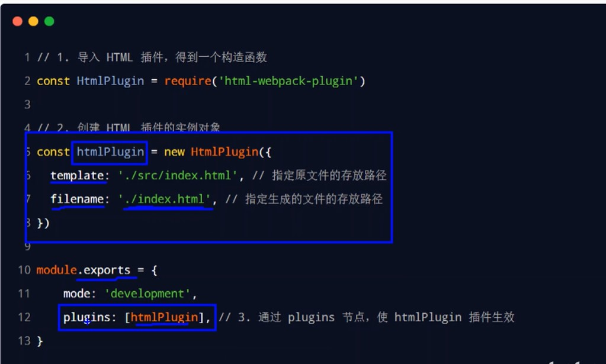
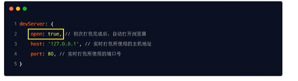
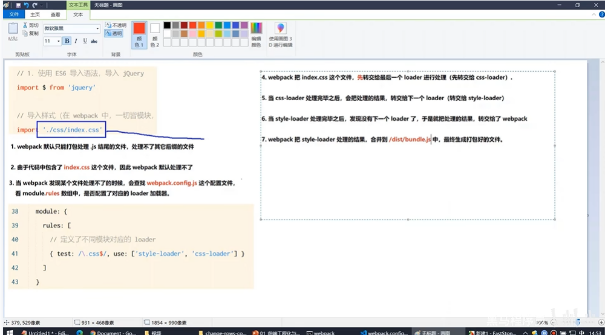

webpack将文件放在内存而非硬盘--->频繁读写对磁盘影响大 

`npm i html-webpack-plugin -D `
 

更新后自动打包---webpack-dev-server
 
将src文件夹下的文件复制到根目录----html-webpack-plugin

 
webpack.config.js 中 plugins 插件数组
 
打包后自动打开---webpack.config.js 

 

webpack默认只能处理.js，非.js要调用loader加载器才可以正常打包 
当webpack发现某个文件处理不了的时候,会查找webpqack.config.js这个配置文件，看module.rules数组中是否配置了对应的loader加载器 
 

less是less-loader的内置依赖项 
 
 
小图片可以转换成base64 
不建议把轮播图，封面转成base64格式
 
  `{test:/\.jpg|png|gif$/,use:'url-loader?limit=22229'}`
 
图片体积小于limit转成base64，大于不转
 

`{test:/\.js$/,use:'babel-loader',exclude:'node_modules'}`
 
处理高级js语法,排除处理第三方包的兼容性问题--->提高速度,防止报错
 
 
项目发布时执行 build`"build":"webpack --mode production"`
